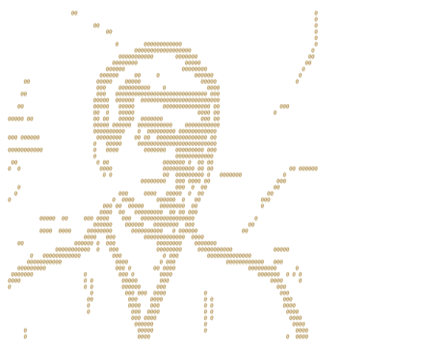

<div align="center">



# 石原ニコラス · Nicolas Ishihara

### 🀄 Professional riichi mahjong player &nbsp;×&nbsp; 💻 Software builder

**Buenos Aires → Osaka**

[](https://nikorasu.dev)
[](https://nikorasu.pro)
[](https://npmahjong.com)
[](https://x.com/nikorasu_pro)

</div>

---

## 👋 About me

I'm an Argentine software developer and professional riichi mahjong player based in Osaka, Japan.

I like building focused products for real communities: developer tools, AI-assisted workflows, multilingual web experiences, and software for mahjong players. The common thread is turning specialist knowledge into something clear and useful.

On the mahjong side, I compete professionally in Japan and publish English-language strategy, tools, coaching, and translation work through [NPMahjong](https://npmahjong.com).

## ⚡ What I'm working with

<div align="center">


</div>

- Agent tooling and practical AI-assisted development
- Product-minded web engineering with TypeScript, React, and Next.js
- Developer experience, reusable workflows, and clear technical communication
- Tools and content for the international riichi mahjong community

## 🚀 Selected work

| Project | What it is |
|:--|:--|
| 🧩 [**Claude Skills Plugin**](https://github.com/nicolas-webdev/claude-skills-plugin) | Reusable Claude Code skills for consistent writing and landing-page creation |
| 🀄 [**NPMahjong**](https://npmahjong.com) | English riichi strategy, coaching, game reviews, tools, and JP↔EN localization |
| 📈 [**MahjongSoul Rank Simulator**](https://github.com/nicolas-webdev/mahjongsoul-rank-simulator) | A small open-source simulator for MahjongSoul rank progression |
| 🌐 [**nikorasu.dev**](https://nikorasu.dev) | My software, experiments, and product work |
| 🎴 [**nikorasu.pro**](https://nikorasu.pro) | My professional mahjong profile |

## 🀄 Mahjong

```text
2009  Discovered riichi mahjong online in Argentina
2016  Moved to Japan
2017  Joined the Japan Professional Mahjong Association
NOW   Competing, coaching, writing, and building tools from Osaka
```

**日本プロ麻雀協会 16期** · **新人王戦 finalist** · **Tenhou 7-Dan**

My work in mahjong spans competition, one-to-one coaching, game analysis, writing, and Japanese–English localization for players and organizations.

## 🌍 Languages & perspective

Spanish · English · Japanese · Portuguese

Living and working across languages shapes how I build: fewer assumptions, clearer interfaces, and more attention to the people on the other side of the screen.

---

<div align="center">

```text
🀀 🀁 🀂 🀃  ·  🀄 🀅 🀆  ·  🀇 🀈 🀉 🀊 🀋 🀌 🀍 🀎 🀏
```

[](https://github.com/nicolas-webdev)

<sub>Software, language, and mahjong—built from Osaka.</sub>

</div>
